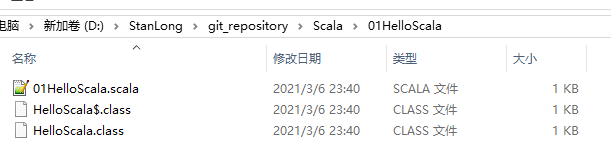
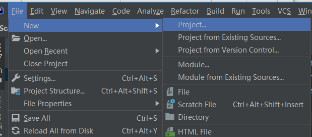
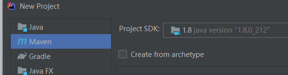
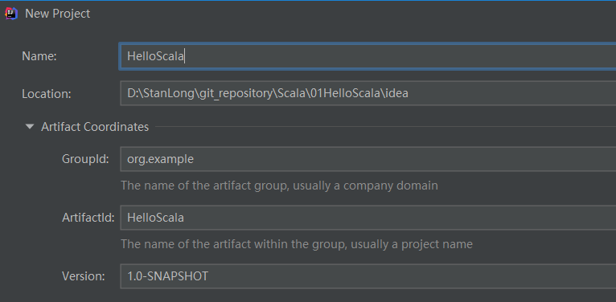
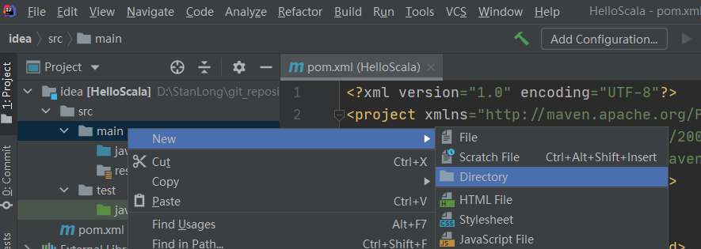
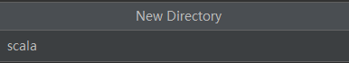
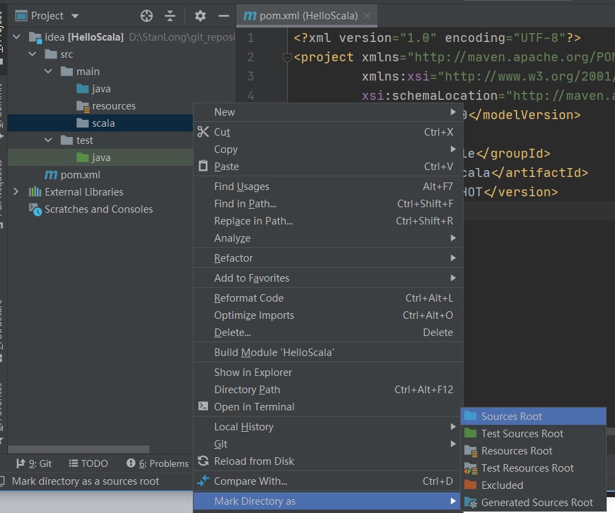
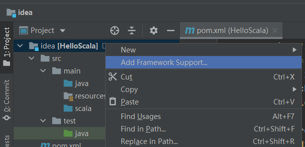
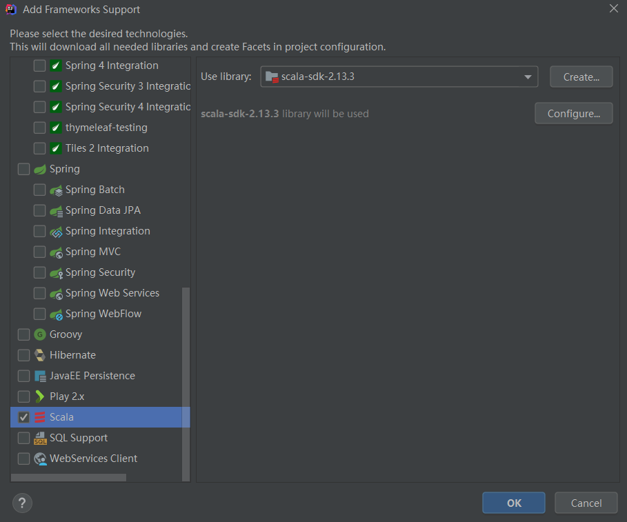

# Scala概述

## 定义

Scala是一门以java虚拟机（JVM）为运行环境并将**面向对象**和**函数式编程**的最佳特性结合在一起

的静态类型编程语言

## 安装

- Scala需要Java运行时库，安装Scala需要**首先安装**JVM虚拟机**并配置好**，推荐安装JDK1.8
- 在http://www.scala-lang.org/ 下载Scala2.11.8程序安装包
- 配置Jdk的环境变量
- 配置SCALA_HOME
   SCALA_HOME= D:\program\scala-2.11.8
- 将Scala安装目录下的bin目录加入到PATH环境变量
   在PATH变量中添加：%SCALA_HOME%\bin
- 在终端中输入“scala”命令打开scala解释器

## 入门代码

### 使用notepad++编写

01HelloScala.scala

```scala
object HelloScala{
    def main(args:Array[String]):Unit={
        println("HelloScala");
    }
}
```


```
1. object 表示一个伴生对象，可以简单的理解为一个对象
2. HelloScala 就是对象的名字，底层真正对应的类名是 HelloScala$
3. 编译后生成了两个文件 HelloScala$.class， HelloScala.class。 
scala 现从 HelloScala的main开始执行， 然后调用 HelloScala$ 的方法， 即执行了这段代码 Predef..MODULE$.println("HelloScala");

4. def 表示是一个方法，是一个关键字
5. main表示方法名，程序执行的入口
6. args:Array[String] 表示形参，scala的特点是将参数写在前面，类型写在后面
7. Array[String] 表示参数类型是个数组
8. :Unit= 表示该函数的返回值为空，类似于Java中的void
```

使用scalac命令编译

```
D:\StanLong\git_repository\Scala\01HelloScala>scalac 01HelloScala.scala
```



HelloScala.class

```java
import scala.reflect.ScalaSignature;

@ScalaSignature(bytes="\006\005%:Q\001B\003\t\002!1QAC\003\t\002-AQAE\001\005\002MAQ\001F\001\005\002U\t!\002S3mY>\0346-\0317b\025\0051\021a\002\037f[B$\030PP\002\001!\tI\021!D\001\006\005)AU\r\0347p'\016\fG.Y\n\003\0031\001\"!\004\t\016\0039Q\021aD\001\006g\016\fG.Y\005\003#9\021a!\0218z%\0264\027A\002\037j]&$h\bF\001\t\003\021i\027-\0338\025\005YI\002CA\007\030\023\tAbB\001\003V]&$\b\"\002\016\004\001\004Y\022\001B1sON\0042!\004\017\037\023\tibBA\003BeJ\f\027\020\005\002 M9\021\001\005\n\t\003C9i\021A\t\006\003G\035\ta\001\020:p_Rt\024BA\023\017\003\031\001&/\0323fM&\021q\005\013\002\007'R\024\030N\\4\013\005\025r\001")
public final class HelloScala
{
  public static void main(String[] paramArrayOfString)
  {
    HelloScala..MODULE$.main(paramArrayOfString);
  }
}
```

HelloScala$.class

```java
import scala.Predef.;

public final class HelloScala$
{
  public static final  MODULE$ = new ();

  public void main(String[] args) { Predef..MODULE$.println("HelloScala"); }

}
```

使用scala执行编译后的文件

```scala
D:\StanLong\git_repository\Scala\01HelloScala>scala HelloScala
HelloScala
```

说明：可以用 scala 命令执行javac编译出来的class文件，但是不能用 java 执行 scalac 编译出来的class文件

### 使用idea编写

- 新建maven工程








- 再main下新建一个名为scala目录，并设置为Source ROOT







- 加入scala框架支持





设置完成后，编写scala代码

## Java模拟Scala运行机制

```java
package com.stanlong.scala.test;

public class TestScala {
    public static void main(String[] paramArrayOfString) {
        TestScala$.MODULE$.main(paramArrayOfString);
    }
}

final class TestScala$
{
    public static final TestScala$ MODULE$;
    static {
        MODULE$ = new TestScala$();
    }

    public void main(String[] args) {
        System.out.print("HelloScala");
    }

}
```

