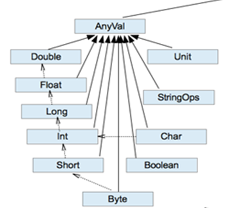

# 类型转换

## 数据类型体系

实线头表示继承关系，虚线头表示隐式转换的方向


## 数据类型列表

### 整型

| 数据类型 | 描述                                                         |
| -------- | ------------------------------------------------------------ |
| Byte     | 8位有符号补码整数。数值区间为 -128  到 127                   |
| Short    | 16位有符号补码整数。数值区间为 -32768  到 32767              |
| Int      | 32位有符号补码整数。数值区间为 -2147483648  到 2147483647    |
| Long     | 64位有符号补码整数。数值区间为 -9223372036854775808  到 9223372036854775807 |

### 浮点型

| 数据类型 | 描述                              |
| -------- | --------------------------------- |
| Double   | 64 位 IEEE 754标准的双精度浮点数  |
| Float    | 32 位, IEEE 754标准的单精度浮点数 |

### 字符型

| 数据类型 | 描述                             |
| -------- | -------------------------------- |
| Char     | 字符类型表示单个字符，用''括起来 |
| String   | 字符序列                         |

### 布尔型

| 数据类型 | 描述        |
| -------- | ----------- |
| Boolean  | true或false |

### 空类型

| 数据类型 | 描述                                                         |
| -------- | ------------------------------------------------------------ |
| Unit     | 表示无值，和其他语言中void等同。用作不返回任何结果的方法的结果类型。Unit只有一个实例值，写成()。 |
| Null     | null  , Null 类型只有一个实例值  null                        |
| Nothing  | Nothing类型在Scala的类层级的最低端；它是任何其他类型的子类型。  当一个函数，我们确定没有正常的返回值，可以用Nothing 来指定返回类型，这样有一个好处，就是我们可以把返回的值（异常）赋给其它的函数或者变量（兼容性） |

```scala
package com.stanlong.scala

/**
 * 空类型
 * Unit
 * null
 * Nothing
 */
object Exercise01 {
    def main(args: Array[String]): Unit ={
        // 1. Unit
        def m1():Unit={
            println("m1被调用执行")
        }
        val a = m1()
        println("a: " + a) // 打印结果 a: ()

        // 2. null
        // val b:Int = null // 报错： an expression of type Null is ineligible for implicit conversion
        var student = new Student("张三", 20)
        student = null
        println(student) // 打印结果 null

        // 3. Nothing
        def m2(n:Int) :Nothing = {
            throw new NullPointerException
        }

        val b:Int = m2(2)
        println("b: " + b) // 打印结果： Exception in thread "main" java.lang.NullPointerException

        // 说明： Nothing是任何类型的子类型，如果有逻辑判断，函数方法可以做如下修改
        def m3(n:Int):Int={
            if(n == 0){
                throw new NullPointerException
            }else{
                n
            }
        }

        val c:Int = m3(2)
        println("c: " + c) // 打印结果：2

    }

    class Student(name:String, age:Int){

    }
}
```

### 公共父类型

| 数据类型 | 描述                                               |
| -------- | -------------------------------------------------- |
| Any      | Any是所有其他类的超类                              |
| AnyRef   | AnyRef类是Scala里所有引用类(reference class)的基类 |

## 值类型转换

当Scala程序在进行赋值或者运算时，**精度小的类型自动转换为精度大的数据类型，这个就是自动类型转换(**隐式转换) . 数据类型按精度(容量)大小排序为



## 自动类型转换细节说明

1)有多种类型的数据混合运算时，系统首先自动将所有数据转换成容量最大的那种数据类型，然后再进行计算。 5.6 + 10 = 》double

2)当我们把精度(容量)大 的数据类型赋值给精度(容量)小 的数据类型时，就会报错，反之就会进行自动类型转换。

3)(byte, short) 和 char之间不会相互自动转换。

4)byte，short，char 他们三者可以计算，在计算时首先转换为int类型。

5)自动提升原则： 表达式结果的类型自动提升为 操作数中最大的类型

## 强制类型转换

1)当进行数据的 从 大——>小，就需要使用到强制转换

2)强转符号只针对于最近的操作数有效，往往会使用小括号提升优先级

3)Char类型可以保存 Int的常量值，但不能保存Int的变量值，需要强转

4)Byte和Short类型在**进行运算**时，当做Int类型处理。

## 类型转换联系

```scala
判断是否能够通过编译,并说明原因
1）var s : Short  = 5 // ok
       s = s-2    //  error  Int -> Short                
2） var b : Byte  = 3    // ok
        b = b + 4              // error Int ->Byte     
        b = (b+4).toByte       // ok ，使用强制转换
3）var c : Char  = 'a'  //ok
   var  i : Int = 5 //ok
   var d : Float = .314F //ok
   var result : Double = c+i+d     //ok Float->Double
4） var b : Byte  = 5 // ok
    var s : Short  = 3 //ok
    var t : Short = s + b // error Int->Short
    var t2 = s + b   // ok, 使用类型推导
```

```scala
package com.stanlong.scala

/**
 *  类型转换面试题
 */
object Exercise01 {
    def main(args: Array[String]): Unit ={
        val n:Int = 130
        val b:Byte = n.toByte
        println(b) // -126
    }
}
```

## 值类型和String类型的转换

通过基本类型的String的toXxx方法即可

```scala
"12"
s1.toInt
s1.toFloat
s1.toDouble
s1.toByte
s1.toLong
s1.toShort
```

```scala
package com.stanlong.scala

/**
 *  字符串比较
 */
object Exercise01 {
    def main(args: Array[String]): Unit ={
        val str1:String = "Hello"
        val str2:String = new String("Hello")

        println(str1 == str2) // true 【== 比较值】
        println(str1.equals(str2)) // true  【equals比较值】
        println(str1.eq(str2)) // false 【eq 比较引用地址】

    }
}
```

