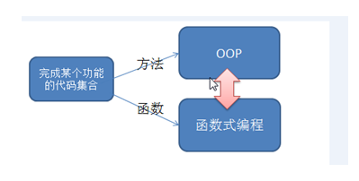

# 函数式编程



```scala
package com.stanlong.scala

import scala.util.control.Breaks.{break, breakable}

/**
 * 函数和方法
 */
object Exercise01 {
    def main(args: Array[String]): Unit = {
        // 方法
        val operator = new Operator
        println(operator.add_operator(10,20))

        // 方法转函数
        val f1 = operator.add_operator _ // 注意这有个下划线
        println("f1=" + f1)
        // f1=com.stanlong.scala.Exercise01$$$Lambda$3/1205044462@22a71081
        println("f1=" + f1(10,20))
        // f1=30

        // 函数
        val f2 = (n1:Int, n2:Int) =>{
            n1 + n2
        }
        println("f2=" + f2)
        // f2=com.stanlong.scala.Exercise01$$$Lambda$4/1654589030@1bc6a36e
        println("f2=" + f2(10,20))
        // f2=30

    }
}

class Operator{
    def add_operator(n1:Int, n2:Int):Int={
        n1 + n2
    }
}
```

```
基本语法
def 函数名 ([参数名: 参数类型], ...)[[: 返回值类型] =] {
	语句...
	return 返回值
}
函数声明关键字为def  (definition)
[参数名: 参数类型], ...：表示函数的输入(就是参数列表), 可以没有。 如果有，多个参数使用逗号间隔
函数中的语句：表示为了实现某一功能代码块
函数可以有返回值,也可以没有
返回值形式1:    : 返回值类型  =   
返回值形式2:    =  表示返回值类型不确定，使用类型推导完成
返回值形式3:      表示没有返回值，return 不生效
如果没有return ,默认以执行到最后一行的结果作为返回值
```

递归


```scala
package com.stanlong.scala

/**
 * 递归
 */
object Exercise01 {
    def main(args: Array[String]): Unit = {
        println(fbn(5))

    }
    // 斐波那契数列
    def fbn(n:Int):Int={
        if( n == 1 || n == 2){
            return 1
        }else{
            return fbn(n-1) + fbn(n-2)
        }

    }
}
```

可变形参

```scala
package com.stanlong.scala

/**
 * 可变形参
 */
object Exercise01 {
    def main(args: Array[String]): Unit = {
        var result = sum(10, 20, 30, 40)
        println(result)

    }
    // args:Int* 可变形参，可变形参得是最后一个参数
    def sum(num1:Int, args:Int*):Int ={
        var sum = num1;
        for(item <- args){
            sum = sum + item
        }
        sum // scala 语言可以省略return
    }
}
```

