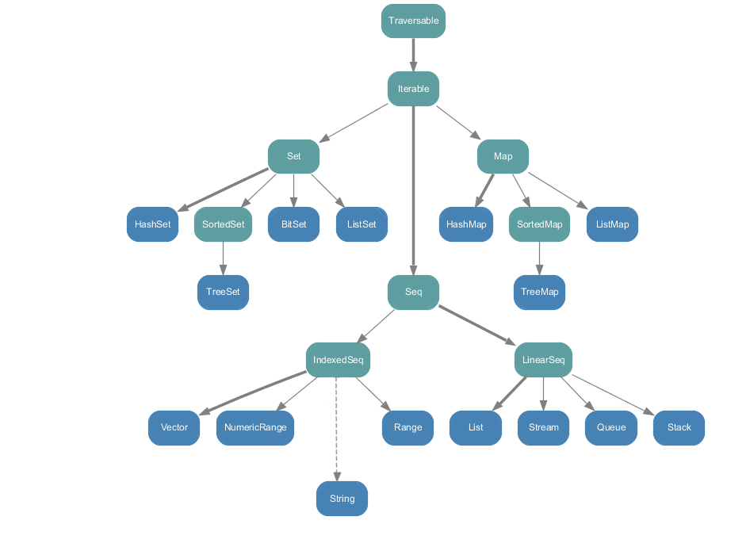

# 集合

- 不可变集合：就是指该集合对象不可修改，每次修改就会返回一个新对象，而不会对原对象进行修改。类似于 Java 中的 String 对象
- 可变集合：就是这个集合可以直接对原对象进行修改，而不会返回新的对象。类似于 Java 中的 StringBuilder对象

**建议：** 在操作集合的时候，不可变用符号，可变用方法

不可变集合关系继承图：蓝色表示具体的类型，另一种颜色表示特征



不可变集合关系继承图：蓝色表示具体的类型，另一种颜色表示特征


## 数组

### 不可变数组

```scala
package com.stanlong.scala

/**
 * 不可变数组
 */
object HelloScala {

    def main(args: Array[String]): Unit = {
        // 第一种方式，使用默认值
        val arr01 = new Array[Int](4) // [Int]表示该数组只能放Int， [Any] 表示可以存任何类型
        // 第二种方式：指定初始值
        val arr02 = Array(1, 2, "xxx")

        // 通过下标修改数组
        arr02(2) = 3
        println(arr02(2))

        // 添加元素(在列表最后添加) :+
        val arr03 = arr02.:+(4) // 或者写成 val arr03 = arr02 :+ 4
        println(arr03.mkString(","))  // 1,2,3,4

        // 添加元素(在列表前面添加) +:
        val arr04 = arr02.+:(0) // 或者写成 val arr04 = 0 +: arr02 注意顺序
        println(arr04.mkString(",")) // 0,1,2,3

        // 获取数组长度
        println(arr01.length)

        // 遍历数组的集中方式

        // 1. 直接遍历(增强for循环)
        for (i <- arr02) {
            println(i)
        }

        // 2. 使用下标遍历数组
        for (index <- 0 until arr02.length){
            printf("arr02[%d]=%s ", index, arr02(index) + "\t")
        }

        // 3. 方式2 的简写
        for( i <- arr02.indices){
            println(arr02(i))
        }

        // 4. 使用迭代器
        val iter = arr02.iterator
        while (iter.hasNext){
            println(iter.next())
        }

        // 5. foreach 方法
        arr01.foreach((elem: Int) => println(elem))
        // 简写
        arr01.foreach(println)

    }
}
```

### 可变数组

```scala
package com.stanlong.scala

import scala.collection.mutable
import scala.collection.mutable.ArrayBuffer


/**
 * 可变数组
 */
object HelloScala {

    def main(args: Array[String]): Unit = {
        // 创建可变数组
        val arr01 = ArrayBuffer[Int]()
        val arr02 = ArrayBuffer(1,2,3,4)
        println(arr02) // ArrayBuffer(1, 2, 3, 4) 底层调用的是 arr02.toString()

        // 添加元素(在后面添加)
        arr01.append(5) // 或者 arr01 += 5
        println(arr01)

        // 添加元素(在前面添加)
        arr01.prepend(0) // 或者 0 +=: arr01
        println(arr01)

        // 指定索引位置添加
        arr01.insert(1,2,3,4,5)
        println(arr01)

        // 追加数组
        arr01.insertAll(2, arr02) // 同样有 appendAll 和 prependAll
        println(arr01)


        //删除
        arr01.remove(0) // 删除索引 0 位置的元素
        println(arr01)
        arr01.remove(1, 4) // 从索引1开始，往后删除4个, 包含索引1的元素
        println(arr01)
        arr01 -= 5 // 直接删除元素值， 有就删除， 有重复的话只会删掉一个
        println(arr01)

        // 可变数组转换为不可变数组
        val arr03 = arr01.toArray
        println(arr03.mkString(","))
        println(arr01)

        // 不可变数组转换为可变数组
        val buffer: mutable.Buffer[Int]  arr03.toBuffer
        println(buffer)
    }
}
```

### 数组复制


## 多维数组

```scala
package com.stanlong.scala

/**
 * 多维数组
 */
object HelloScala {

    def main(args: Array[String]): Unit = {
        // 创建二维数组
        val array1 = Array.ofDim[Int](3, 4)

        // 访问元素
        println(array1(0)(1))

        // 修改元素
        array1(1)(1) = 9

        // 遍历多维数组
        // 方式一 : 增强for循环
        for (item <- array1) {
            for (item2 <- item) {
                print(item2 + "\t")
            }
            println()
        }
        println("===================")

        // 方式二: 使用下标遍历多维数组
        for (i <- 0 to array1.length - 1) {
            for (j <- 0 to array1(i).length - 1) {
                printf("arr[%d][%d]=%d\t", i, j, array1(i)(j))
            }
            println()
        }

        // 方式二简写
        // indices方法可以返回指定列表的所有有效索引值组成的列表
        for (i <- array1.indices; j <- array1(i).indices){
            // println(array1(i)(j))
            print(array1(i)(j) + "\t")
            if(j == array1(i).length -1){
                println()
            }
        }

        // 方式三： foreach
        array1.foreach(line => line.foreach(println))
        // 简写
        array1.foreach(_.foreach(println))
    }
}
```

## 列表List

### 不可变列表

```scala
package com.stanlong.scala

/**
 * 不可变列表
 * 在scala中List默认为不可变的集合
 */
object HelloScala {

    def main(args: Array[String]): Unit = {

        //创建List
        val list01 = List(1, 2, 3)

        // 访问
        println(list01)
        println(list01(1))

        // 遍历
        list01.foreach(println)

        // 追加元素
        // 方式一
        // 在列表后追加元素
        val list03 = list01 :+ 4
        println(list03)

        // 在列表前追加元素 注意顺序
        val list04 = 4 +: list01
        println(list04)

        // 方式二 ::
        // 往空列表里追加元素
        // 运算时，集合对象一定要放置在最右边
        // 运算规则，从右向左
        val list06 = 1 :: 2 :: 3 :: 4 :: Nil
        println(list06)

        // 合并列表
        // 方式一  ::: 运算符, ::: 两边都必须是集合元素
        val list07 = 1 :: 2 :: 3 :: list01 :::Nil
        println(list07)

        // 方式二  ++ 运算符
        val list08 = list01 ++ list07
        println(list08)
    }
}
```

### 可变列表

```scala
package com.stanlong.scala

import scala.collection.mutable.ListBuffer

/**
 * 可变列表
 */
object HelloScala {

    def main(args: Array[String]): Unit = {
        // 创建可变列表
        val list0 = ListBuffer[Int](1, 2, 3)
        val list1 = ListBuffer(12,23,45)

        println(list0)
        println(list1)

        // 添加元素
        list0.append(5) // 在后面添加
        list0.prepend(0) // 在前面添加
        list0.insert(2,300) // 指定位置添加

        // 合并列表
        val list2 = list0 ++ list1
        println(list0) // 不变
        println(list1) // 不变
        println(list2) // 合并

        list0 ++= list1 // 如果是 ++=: 那结果就是 list0 不变, list1 合并
        println(list1) // 不变
        println(list0) // 合并

        // 修改元素
        list1(0) = 0
        list1.update(2, 20)
        println(list1)

        // 删除
        list1.remove(1)
        list1 -= 45
        println(list1)
    }
}
```

## Set集合

### 不可变Set集合

```scala
package com.stanlong.scala

/**
 * Set集合
 * 默认情况下，Scala 使用的是不可变Set集合
 */
object HelloScala {

    def main(args: Array[String]): Unit = {

        // 创建
        val set01 = Set(1,2,4,1,2,3)
        println(set01) // 会去重， 打印结果 Set(1, 2, 4, 3)

        // 新增
        val set02 = set01.+(20)
        // 或者
        // val set02 = set01 + 100
        println(set02) // Set(20, 1, 2, 3, 4) 打印结果无序

        // 合并Set
        val set03 = set01 ++ set02
        println(set03)

        // 删除
        val set04 = set03 - 20
        println(set04)
    }
}
```

### 可变Set集合

```scala
package com.stanlong.scala

import scala.collection.mutable

/**
 * Set集合
 * 可变Set集合
 */
object HelloScala {

    def main(args: Array[String]): Unit = {

        // 创建可变 Set
        val set01 = mutable.Set(1,2,4, 4,3,4)
        println(set01) // Set(1, 2, 3, 4)

        // 新增
        set01 += 90
        set01.add(90)
        println(set01)

        // 删除
        set01 -= 2
        set01.remove(2)
        println(set01)

        // 合并set
        val set02 = mutable.Set(100,200,400)
        val set03 = set01 ++ set02
        println(set03)
        // 或者
        set01 ++= set02
        println(set01)
    }
}
```

## Map集合

### 不可变Map

```scala
package com.stanlong.scala

/**
 * Map 集合
 * 默认不可变 Map
 */
object HelloScala {

    def main(args: Array[String]): Unit = {

        // 创建
        val map1 = Map("Alice" -> 10, "Bob" -> 20, "Kotlin" -> 30)
        println(map1) // Map(Alice -> 10, Bob -> 20, Kotlin -> 北京)

        // 取值
        val value1 = map1("Alice")
        // 或者
        // val value1 = map1.get("Alice").get
        // val value1 = map1.getOrElse("Alice", "null") 推荐使用，可以避免空指针异常
        println(value1)

        // 遍历
        map1.foreach(( kv: (String, Int)) => println(kv))
        // 简写
        map1.foreach(println)

        // 遍历所有的key
        for (key <- map1.keys) {
            println(s"$key ---> ${map1.get(key)}")
        }
        // 遍历所有的value
        for (v <- map1.values) {
            println(v)
        }
    }
}
```

### 可变Map

```scala
package com.stanlong.scala

import scala.collection.mutable

/**
 * Map 集合
 * 可变 Map
 */
object HelloScala {

    def main(args: Array[String]): Unit = {

        // 创建可变Map
        val map1 = mutable.Map("Alice" -> 10, "Bob" -> 20, "Kotlin" -> 30)
        println(map1)

        // 添加
        map1 += ( "C" -> 3 )
        map1.put("F" , 6)
        println(map1)

        // 删除
        map1 -= "C"
        map1.remove("F")
        println(map1)

        // 修改
        map1.update("C", 3)
        map1("Bob") = 40
        println(map1)

        // 合并
        val map2 = mutable.Map( ("A", 1), ("B", 2), ("C", 3),("D", 30) )
        map1 ++= map2
        val map3 = map1 ++ map2
        println(map1)
        println(map3)
        
        // 是否包含
        println(map1.contains("A"))
    }
}
```

## 元组

```scala
package com.stanlong.scala

import scala.collection.mutable

/**
 * 元组
 * 可以存放各种相同或不同类型的数据
 * 元组中最大只能有22个元素
 */
object HelloScala {

    def main(args: Array[String]): Unit = {

        // 创建
        val tuple1 = (1, 2, 3, "hello", 4, true)
        println(tuple1)

        // 访问
        println(tuple1._1) //访问元组的第 _x 个元素
        println(tuple1._2)
        println(tuple1._3)
        println(tuple1.productElement(0)) // 按索引范围，从0开始

        // 遍历
        for ( item <- tuple1.productIterator ) {
            println(item)
        }

        // 嵌套
        val tuple2 = (1, 2, 3, "hello", 4, true, (1, 2, 3, "hello", 4, true))
        println(tuple2._7._6)
    }
}
```

## 队列

```scala
package com.stanlong.scala

import scala.collection.immutable.Queue
import scala.collection.mutable

/**
 * 队列
 * 先进先出
 */
object HelloScala {

    def main(args: Array[String]): Unit = {
        // 创建可变队列
        val q = new mutable.Queue[Int]()
        println(q)

        // 入队
        q += 9
        q ++= List(1,2,3)
        q.enqueue(20,60)
        println(q)

        // 出队
        q.dequeue() //从队列头部取出元素
        println(q)

        // 创建不可变队列
        val q2 = Queue("a", "b", "c")
        val q3 = q2.enqueue("d")
        println(q2) // Queue(a, b, c) 不变
        println(q3) // Queue(a, b, c, d)
    }
}
```


