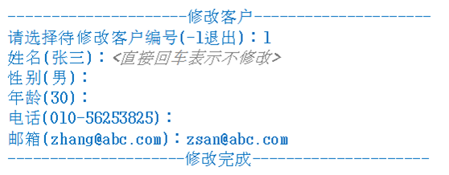
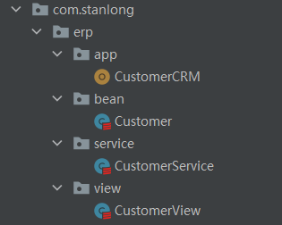

# CRM项目

模拟实现基于文本界面的《客户信息管理软件》。

该软件scala能够实现对客户对象的插入、修改和删除,显示，查询（用ArrayBuffer或者ListBuffer实现），并能够打印客户明细表

## 界面

客户列表


添加客户


删除客户


修改客户



## 代码

目录结构



> 目录结构说明

app : 程序入口

bean： Customer 实体类

server： 业务处理

view : 视图处理

**CustomerCRM**

```scala
package com.stanlong.erp.app

import com.stanlong.erp.view.CustomerView

object CustomerCRM {

    def main(args: Array[String]): Unit = {
        new CustomerView().mainMenu()
    }
}
```

**Customer**

```scala
package com.stanlong.erp.bean

class Customer {
    // 属性
    var id:Int = _
    var name:String = _
    var gender:Char = _
    var age:Short = _
    var tel:String = _
    var email:String = _

    // 设计一个辅助构造器
    def this(id:Int, name:String,gender:Char,age:Short,tel:String, email:String){
        this
        this.id = id
        this.name = name
        this.gender = gender
        this.age = age
        this.tel = tel
        this.email = email
    }

    // 设计一个不包含id的辅助构造器
    def this(name:String,gender:Char,age:Short,tel:String, email:String){
        this
        this.name = name
        this.gender = gender
        this.age = age
        this.tel = tel
        this.email = email
    }

    // 重写toString方法
    override def toString: String = {
        this.id + "\t" + this.name + "\t" + this.gender + "\t" + this.age + "\t" + this.tel + "\t" + this.email
    }
}
```

**CustomerService**

```scala
package com.stanlong.erp.service

import com.stanlong.erp.bean.Customer

import scala.collection.mutable.ArrayBuffer
import scala.util.control.Breaks.{break, breakable}

class CustomerService {

    // 初始id
    var customerId = 1

    var customers = ArrayBuffer(new Customer(1, "沈万三", '男', 24, "100", "shenwansan@ming.com"))

    // 客户列表
    def list():ArrayBuffer[Customer]={
        this.customers
    }

    // 添加客户
    def add(customer: Customer):Boolean = {
        // 设置id
        customerId += 1
        customer.id = customerId
        customers.append(customer)
        true
    }

    // 查找单个用户在ArrayBuffer的下标索引
    def findById(id:Int): Int ={
        var index = -1 // 如果找到就返回对应的id，没找到就返回-1
        breakable{
            for(i <- 0 until customers.length){
                if(customers(i).id == id){
                    index = i
                    break()
                }
            }

        }
        index
    }

    // 查找单个用户
    def findCustomerById(id:Int):Customer={
        val customer = customers(id-1)
        return customer
    }

    // 修改客户
    def update(customer: Customer):Boolean={
        val id = customer.id
        customers(id-1) = customer
        true
    }


    // 删除
    def delete(id:Int):Boolean={
        val index = findById(id)
        if (index != -1){
            customers.remove(index)
            true
        }else{
            false
        }
    }
}
```

**CustomerView**

```scala
package com.stanlong.erp.view

import com.stanlong.erp.bean.Customer
import com.stanlong.erp.service.CustomerService

import scala.io.StdIn

class CustomerView {

    // 定义循环变量，推出循环
    var loop = true

    // 接受用户输入的选项
    var key = ' '

    val customerService = new CustomerService()

    def mainMenu():Unit = {
        do {
            println("-----------------客户信息管理软件-----------------")
            println("                 1 添 加 客 户")
            println("                 2 修 改 客 户")
            println("                 3 删 除 客 户")
            println("                 4 客 户 列 表")
            println("                 5 退       出")
            println("请选择(1-5):")
            key = StdIn.readChar()
            key match {
                case '1' => {
                    this.add()
                }
                case '2' => {
                    this.update()
                }
                case '3' => {
                    this.delete()
                }
                case '4' => {
                    this.list()
                }
                case '5' =>{
                    println("退       出")
                    this.loop = false
                }
                case _ =>{
                    println("输入错误，请重写输入")
                }
            }

        }while(loop)
    }

    // 列表展示
    def list(): Unit ={
        println()
        println("---------------------------客户列表---------------------------")
        println("编号\t姓名\t性别\t年龄\t电话\t邮箱")
        val customers = customerService.list()
        for (customer <- customers){
            println(customer)
        }
    }

    // 添加
    def add(): Unit ={
        println("---------------------添加客户---------------------")
        print("姓名：")
        val name = StdIn.readLine()
        print("性别：")
        val gender = StdIn.readChar()
        print("年龄：")
        val age = StdIn.readShort()
        print("电话：")
        val tel = StdIn.readLine()
        print("邮箱：");
        val email = StdIn.readLine()

        val customer = new Customer(name, gender, age, tel, email)
        customerService.add(customer)
        println("---------------------添加完成---------------------")

    }

    // 修改
    def update(): Unit ={
        println("---------------------修改客户---------------------")
        println("请选择待修改客户编号(-1退出)：")
        val id = StdIn.readInt()
        if(id == -1){
            println("---------------------退出---------------------")
            return
        }
        val customer = customerService.findCustomerById(id)
        print(customer)
        println()
        print("姓名：")
        val name = StdIn.readLine()
        print("性别：")
        val gender = StdIn.readChar()
        print("年龄：")
        val age = StdIn.readShort()
        print("电话：")
        val tel = StdIn.readLine()
        print("邮箱：");
        val email = StdIn.readLine()

        val customerNew = new Customer(id, name, gender, age, tel, email)
        val flag = customerService.update(customerNew)
        if(flag){
            println("---------------------修改成功---------------------")
            return
        }
        println("---------------------修改失败---------------------")
    }

    // 删除
    def delete(): Unit ={
        println("---------------------删除客户---------------------")
        println("请选择待删除客户编号(-1退出)：")
        val id = StdIn.readInt()
        if(id == -1){
            println("---------------------删除没有完成---------------------")
            return
        }
        println("确认是否删除(Y/N)：")
        var choice = StdIn.readChar().toLower
        if (choice == 'y'){
            if(customerService.delete(id)){
                println("---------------------删除完成---------------------")
                return
            }
        }
        println("---------------------删除没有完成---------------------")
    }
}
```

