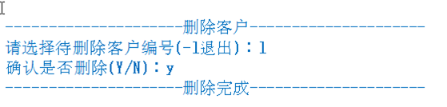

# CRM项目

模拟实现基于文本界面的《客户信息管理软件》。

该软件scala能够实现对客户对象的插入、修改和删除,显示，查询（用ArrayBuffer或者ListBuffer实现），并能够打印客户明细表

## 界面

### 列表展示

实现示客户列表


添加客户


删除客户



修改客户


## 开发

### 目录结构


Customer.scala

```scala
package com.stanlong.erp.bean

class Customer {
    // 属性
    var id:Int = _
    var name:String = _
    var gender:Char = _
    var age:Short = _
    var tel:String = _
    var email:String = _

    // 设计一个辅助构造器
    def this(id:Int, name:String,gender:Char,age:Short,tel:String, email:String){
        this
        this.id = id
        this.name = name
        this.gender = gender
        this.age = age
        this.tel = tel
        this.email = email
    }
}
```

