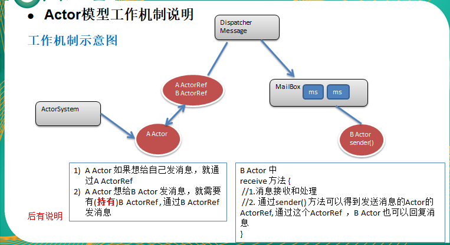
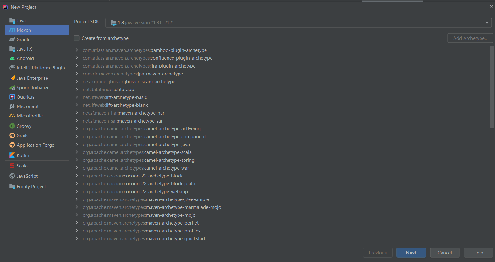
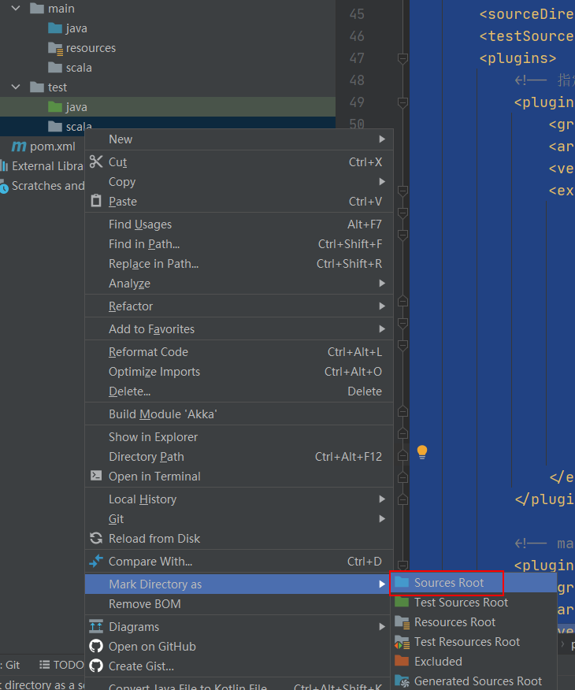
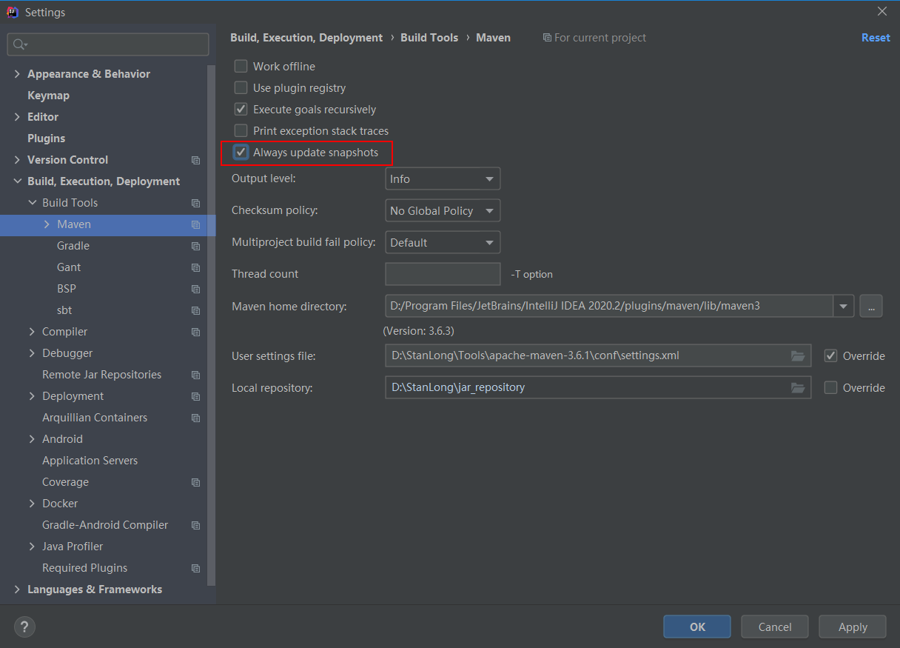

# AKKA

1. Akka是一个开发库和运行环境，可以用于构建高并发、分布式、可容错、事件驱动的基于JVM的应用，使构建高并发的分布式应用更加容易。
2. Akka用Scala语言写成，同时提供了Scala和JAVA的开发接口。
3. Akka主要解决的问题是：可以轻松的写出高效稳定的并发程序，程序员不再过多的考虑线程、锁和资源竞争等细节。

https://avsox.website/cn

## Actor 模型

处理并发问题关键是要保证共享数据的一致性和正确性，因为程序是多线程时，多个线程对同一个数据进行修改，若不加同步条件，势必会造成数据污染。但是当我们对关键代码加入同步条件synchronized 后，实际上大并发就会阻塞在这段代码，对程序效率有很大影响。若是用单线程处理，不会有数据一致性的问题，但是系统的性能又不能保证。Actor 模型的出现解决了这个问题，简化并发编程，提升程序性能。 


1. Akka 处理并发的方法基于 Actor 模型。(示意图)

2. 在基于 Actor 的系统里，所有的事物都是 Actor，就好像在面向对象设计里面所有的事物都是对象一样。

3. Actor 模型是作为一个并发模型设计和架构的。Actor 与 Actor 之间只能通过消息通信，如图的信封。

4. Actor 与 Actor 之间只能用消息进行通信，当一个 Actor 给另外一个 Actor发消息，消息是有顺序的(消息队列)，只需要将消息投寄的相应的邮箱即可。

5. 怎么处理消息是由接收消息的Actor决定的，发送消息Actor可以等待回复，也可以异步处理【ajax】

6. ActorSystem 的职责是负责创建并管理其创建的 Actor， ActorSystem 是单例的(可以ActorSystem是一个工厂，专门创建Actor)，一个 JVM 进程中有一个即可，而 Acotr 是可以有多个的。

7. Actor模型是对并发模型进行了更高的抽象。

8. Actor模型是异步、非阻塞、高性能的事件驱动编程模型。

9. Actor模型是轻量级事件处理（1GB 内存可容纳百万级别个 Actor），因此处理大并发性能高.

   



1. ActorySystem创建Actor
2. ActorRef:可以理解成是Actor的代理或者引用。消息是通过ActorRef来发送,而不能通过Actor 发送消息，通过哪个ActorRef 发消息，就表示把该消息发给哪个Actor
3. 消息发送到Dispatcher Message (消息分发器)，它得到消息后，会将消息进行分发到对应的MailBox。(注: Dispatcher Message 可以理解成是一个线程池, MailBox 可以理解成是消息队列，可以缓冲多个消息，遵守FIFO)
4. Actor 可以通过 receive方法来获取消息，然后进行处理。

## Actor模型快速入门


**使用Maven的方式来构建项目**

1. 创建项目 new->new Project -> 选择Maven

   




2. 配置maven依赖

   ```xml
   <?xml version="1.0" encoding="UTF-8"?>
   <project xmlns="http://maven.apache.org/POM/4.0.0"
            xmlns:xsi="http://www.w3.org/2001/XMLSchema-instance"
            xsi:schemaLocation="http://maven.apache.org/POM/4.0.0 http://maven.apache.org/xsd/maven-4.0.0.xsd">
       <modelVersion>4.0.0</modelVersion>
   
       <groupId>org.example</groupId>
       <artifactId>Akka</artifactId>
       <version>1.0-SNAPSHOT</version>
   
       <!-- 定义一下常量 -->
       <properties>
           <encoding>UTF-8</encoding>
           <scala.version>2.11.8</scala.version>
           <scala.compat.version>2.11</scala.compat.version>
           <akka.version>2.4.17</akka.version>
       </properties>
   
       <dependencies>
           <!-- 添加scala的依赖 -->
           <dependency>
               <groupId>org.scala-lang</groupId>
               <artifactId>scala-library</artifactId>
               <version>${scala.version}</version>
           </dependency>
   
           <!-- 添加akka的actor依赖 -->
           <dependency>
               <groupId>com.typesafe.akka</groupId>
               <artifactId>akka-actor_${scala.compat.version}</artifactId>
               <version>${akka.version}</version>
           </dependency>
   
           <!-- 多进程之间的Actor通信 -->
           <dependency>
               <groupId>com.typesafe.akka</groupId>
               <artifactId>akka-remote_${scala.compat.version}</artifactId>
               <version>${akka.version}</version>
           </dependency>
       </dependencies>
   
       <!-- 指定插件-->
       <build>
           <!-- 指定源码包和测试包的位置 -->
           <sourceDirectory>src/main/scala</sourceDirectory>
           <testSourceDirectory>src/test/scala</testSourceDirectory>
           <plugins>
               <!-- 指定编译scala的插件 -->
               <plugin>
                   <groupId>net.alchim31.maven</groupId>
                   <artifactId>scala-maven-plugin</artifactId>
                   <version>3.2.2</version>
                   <executions>
                       <execution>
                           <goals>
                               <goal>compile</goal>
                               <goal>testCompile</goal>
                           </goals>
                           <configuration>
                               <args>
                                   <arg>-dependencyfile</arg>
                                   <arg>${project.build.directory}/.scala_dependencies</arg>
                               </args>
                           </configuration>
                       </execution>
                   </executions>
               </plugin>
   
               <!-- maven打包的插件 -->
               <plugin>
                   <groupId>org.apache.maven.plugins</groupId>
                   <artifactId>maven-shade-plugin</artifactId>
                   <version>2.4.3</version>
                   <executions>
                       <execution>
                           <phase>package</phase>
                           <goals>
                               <goal>shade</goal>
                           </goals>
                           <configuration>
                               <filters>
                                   <filter>
                                       <artifact>*:*</artifact>
                                       <excludes>
                                           <exclude>META-INF/*.SF</exclude>
                                           <exclude>META-INF/*.DSA</exclude>
                                           <exclude>META-INF/*.RSA</exclude>
                                       </excludes>
                                   </filter>
                               </filters>
                               <transformers>
                                   <transformer implementation="org.apache.maven.plugins.shade.resource.AppendingTransformer">
                                       <resource>reference.conf</resource>
                                   </transformer>
                                   <!-- 指定main方法 -->
                                   <transformer implementation="org.apache.maven.plugins.shade.resource.ManifestResourceTransformer">
                                       <mainClass>xxx</mainClass>
                                   </transformer>
                               </transformers>
                           </configuration>
                       </execution>
                   </executions>
               </plugin>
           </plugins>
       </build>
   </project>
   ```

3. 配置scala源码包

   

   并将两个源码包标记成Source Root

   

   当修改后，第一次速度比较慢，因为maven 需要resolve 包的依赖，要下载相关的包 

   **注意** :需要如图勾选，update snapshots, 而且不需要联网,如果使用maven解决依赖后，仍然pom.xml 有误，则只需要重启下idea, 或者 动一下 pom.xml 文件(不用改)，重新保存即可.

   

4. 代码如下

   ```scala
   package com.stanlong.akka.actor
   
   import akka.actor.{Actor, ActorRef, ActorSystem, Props}
   
   // 继承Actor， 重写receive方法
   class SayHelloActor extends Actor{
   
       // 当该 Actor 的MailBox接收到消息，就会调用reveive
       // type Receive = PartialFunction[Any, Unit]
       override def receive: Receive = {
           case "hello" => println("收到Hello， 回应Hello too:)")
           case "ok" => println("收到ok， 回应ok too：)")
           case "exit" => {
               println("接收到exit指令，退出系统")
               context.stop(self) // 停止actorf
               context.system.terminate() // 退出actorsystem
           }
           case _ => println("匹配不到")
   
       }
   }
   
   object SayHelloActorDemo {
   
       // 1. 先创建一个 ActorSystem， 专门用于创建Actor
       private val  actoryFactory = ActorSystem("actoryFactory")
       // 2. 创建一个Actor的同时，返回Actor的ActorRef
       //  Props[SayHelloActor] 使用反射机制创建了一个SayHelloActor实例
       //  sayHelloActor 给actor取名
       //  sayHelloActorRef:ActorRef 就是 Props[SayHelloActor] 的 ActorRef
       //  创建的SayHelloActor实例被ActorSystem接管
       private val sayHelloActorRef:ActorRef = actoryFactory.actorOf(Props[SayHelloActor], "sayHelloActor")
   
   
       def main(args: Array[String]): Unit = {
           // 给SayHelloActor 发消息(邮箱)
           sayHelloActorRef ! "ok"
           sayHelloActorRef ! "exit"
   
       }
   }
   ```

   ```
   程序小结：
   当程序执行 aActorRef = actorFactory.actorOf(Props[AActor], "aActor") ，会完成如下任务 [这是非常重要的方法]
   1) actorFactory 是 ActorSystem("ActorFactory") 这样创建的。
   2) 这里的 Props[AActor] 会使用反射机制，创建一个AActor 对象，如果是actorFactory.actorOf(Props(new AActor(bActorRef)), "aActorRef") 形式，就是使用new 的方式创建一个AActor对象, 注意Props() 是小括号。
   3) 会创建一个AActor 对象的代理对象 aActorRef , 使用aActorRef 才能发送消息
   4) 会在底层创建 Dispather Message ，是一个线程池，用于分发消息， 消息是发送到对应的Actor的 MailBox
   5) 会在底层创建AActor 的MailBox 对象，该对象是一个队列，可接收Dispatcher Message 发送的消息
   6) MailBox 实现了Runnable 接口，是一个线程，一直运行并调用Actor的receive 方法，因此当Dispather 发送消息到MailBox时，Actor 在receive 方法就可以得到信息.
   7) aActorRef !  "hello", 表示把hello消息发送到A Actor 的mailbox （通过Dispatcher Message 转发）
   ```


## Actor间通讯

目录结构


**AActor**

```scala
package com.stanlong.akka.actors

import akka.actor.{Actor, ActorRef}

class AActor(actorRef : ActorRef) extends Actor{

    val bActorRef:ActorRef = actorRef

    override def receive: Receive = {
        case "start" => {
            println("Hi")
            self ! "Hi"
        }
        case "Hi" => {
            // 给BActor发出消息
            // 这里需要持有BActor的引用（BActorRef）
            println("Hello")
            Thread.sleep(1000)
            bActorRef ! "Hello"
        }

        case "How are you" =>{
            println("I'm fine, Thank you")
            bActorRef ! "I'm fine, Thank you"
        }
    }
}
```

**BActor**

```scala
package com.stanlong.akka.actors

import akka.actor.Actor

class BActor extends Actor{
    override def receive: Receive = {
        case "Hello" =>{

            // 通过sender() 可以获取到发送消息的actorRef
            println("How are you")
            Thread.sleep(1000)
            sender() ! "How are you"
        }

    }
}
```

**ActorGame**

```scala
package com.stanlong.akka.actors

import akka.actor.{ActorRef, ActorSystem, Props}

object ActorGame extends App{

    // 创建ActorSystem
    val actoryfactory = ActorSystem("actorfactory")

    // 创建BActorRef
    val bActorRef:ActorRef = actoryfactory.actorOf(Props[BActor], "bActor")

    // 创建AActorRef, AActor有参数，需要用new的形式实现反射
    val aActorRef:ActorRef = actoryfactory.actorOf(Props(new AActor(bActorRef)), "aActor")

    // aActor 说话
    aActorRef ! "start"

}
```

