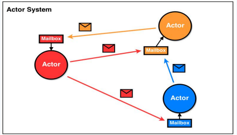
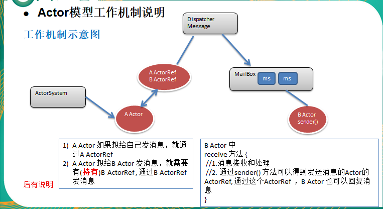
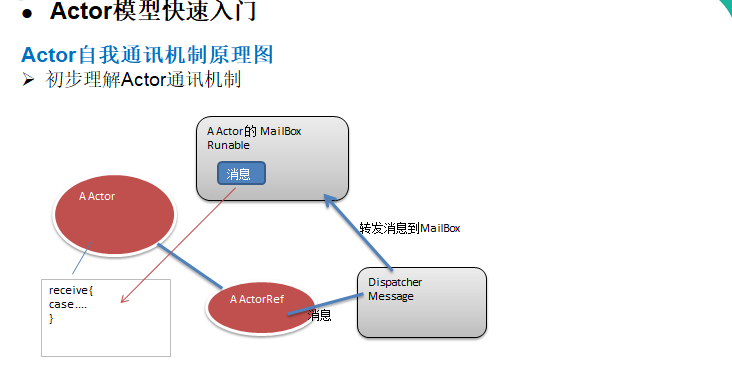
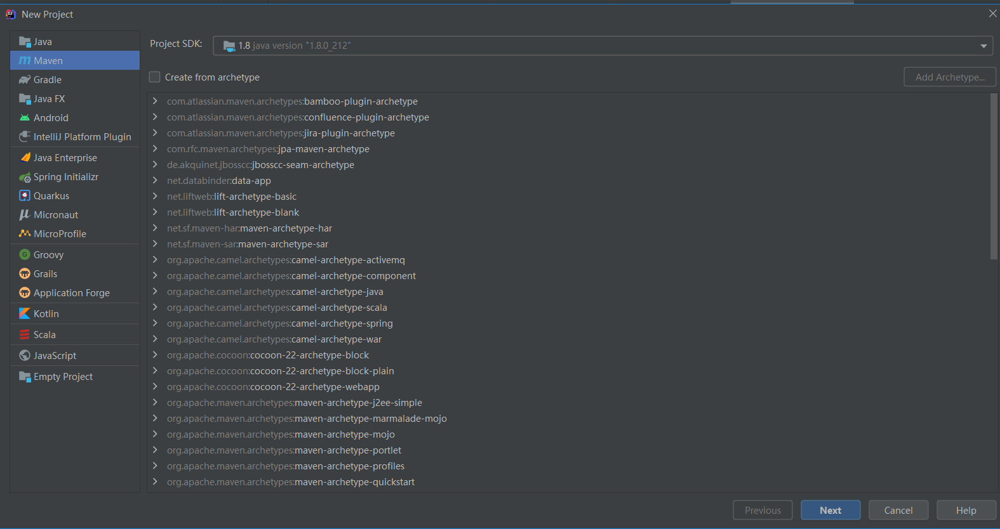
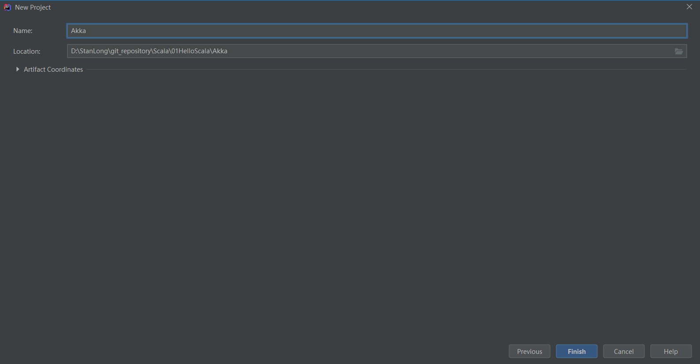
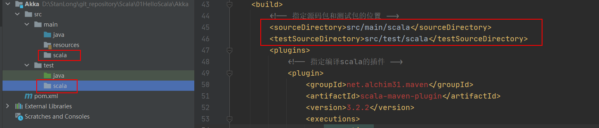
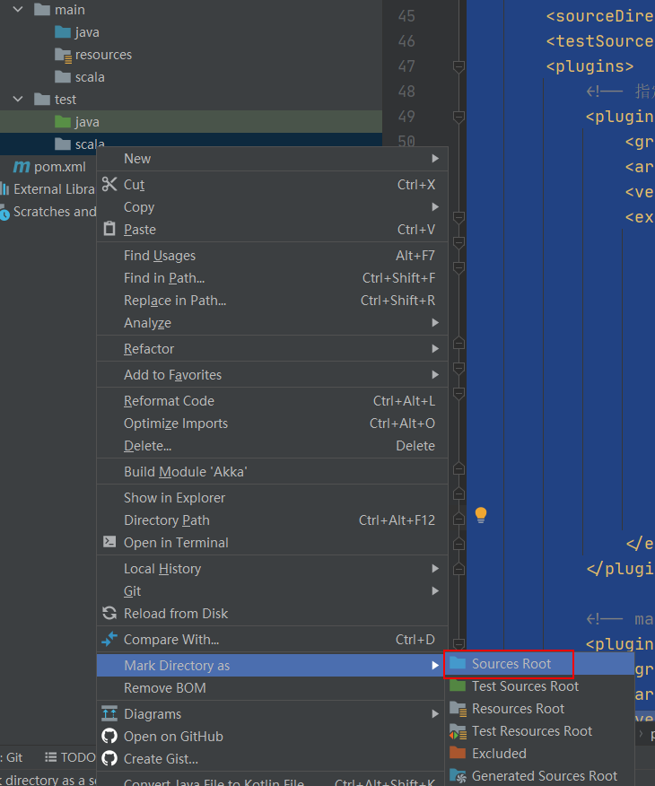
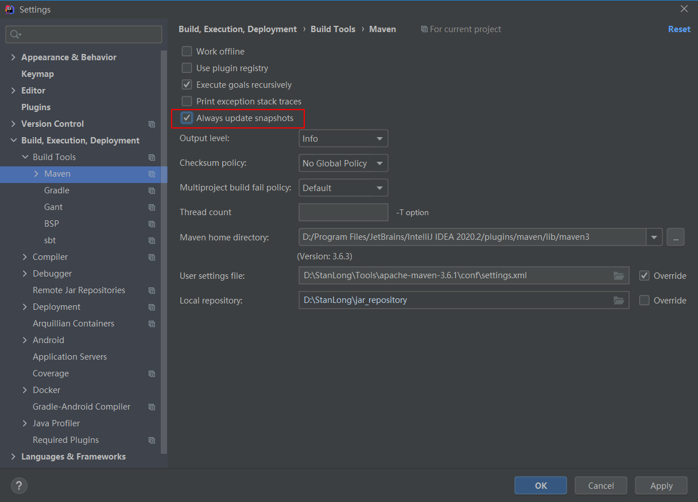

# AKKA

1. Akka是JAVA虚拟机JVM平台上构建高并发、分布式和容错应用的工具包和运行时，你可以理解成Akka是编写并发程序的框架。
2. Akka用Scala语言写成，同时提供了Scala和JAVA的开发接口。
3. Akka主要解决的问题是：可以轻松的写出高效稳定的并发程序，程序员不再过多的考虑线程、锁和资源竞争等细节。

https://avsox.website/cn

## Actor 模型

处理并发问题关键是要保证共享数据的一致性和正确性，因为程序是多线程时，多个线程对同一个数据进行修改，若不加同步条件，势必会造成数据污染。但是当我们对关键代码加入同步条件synchronized 后，实际上大并发就会阻塞在这段代码，对程序效率有很大影响。若是用单线程处理，不会有数据一致性的问题，但是系统的性能又不能保证。Actor 模型的出现解决了这个问题，简化并发编程，提升程序性能。 




1. Akka 处理并发的方法基于 Actor 模型。(示意图)

2. 在基于 Actor 的系统里，所有的事物都是 Actor，就好像在面向对象设计里面所有的事物都是对象一样。

3. Actor 模型是作为一个并发模型设计和架构的。Actor 与 Actor 之间只能通过消息通信，如图的信封。

4. Actor 与 Actor 之间只能用消息进行通信，当一个 Actor 给另外一个 Actor发消息，消息是有顺序的(消息队列)，只需要将消息投寄的相应的邮箱即可。

5. 怎么处理消息是由接收消息的Actor决定的，发送消息Actor可以等待回复，也可以异步处理【ajax】

6. ActorSystem 的职责是负责创建并管理其创建的 Actor， ActorSystem 是单例的(可以ActorSystem是一个工厂，专门创建Actor)，一个 JVM 进程中有一个即可，而 Acotr 是可以有多个的。

7. Actor模型是对并发模型进行了更高的抽象。

8. Actor模型是异步、非阻塞、高性能的事件驱动编程模型。

9. Actor模型是轻量级事件处理（1GB 内存可容纳百万级别个 Actor），因此处理大并发性能高.

   



1. ActorySystem创建Actor
2. ActorRef:可以理解成是Actor的代理或者引用。消息是通过ActorRef来发送,而不能通过Actor 发送消息，通过哪个ActorRef 发消息，就表示把该消息发给哪个Actor
3. 消息发送到Dispatcher Message (消息分发器)，它得到消息后，会将消息进行分发到对应的MailBox。(注: Dispatcher Message 可以理解成是一个线程池, MailBox 可以理解成是消息队列，可以缓冲多个消息，遵守FIFO)
4. Actor 可以通过 receive方法来获取消息，然后进行处理。

## Actor模型快速入门



**使用Maven的方式来构建项目**

1. 创建项目 new->new Project -> 选择Maven

   





2. 配置maven依赖

   ```xml
   <?xml version="1.0" encoding="UTF-8"?>
   <project xmlns="http://maven.apache.org/POM/4.0.0"
            xmlns:xsi="http://www.w3.org/2001/XMLSchema-instance"
            xsi:schemaLocation="http://maven.apache.org/POM/4.0.0 http://maven.apache.org/xsd/maven-4.0.0.xsd">
       <modelVersion>4.0.0</modelVersion>
   
       <groupId>org.example</groupId>
       <artifactId>Akka</artifactId>
       <version>1.0-SNAPSHOT</version>
   
       <!-- 定义一下常量 -->
       <properties>
           <encoding>UTF-8</encoding>
           <scala.version>2.11.8</scala.version>
           <scala.compat.version>2.11</scala.compat.version>
           <akka.version>2.4.17</akka.version>
       </properties>
   
       <dependencies>
           <!-- 添加scala的依赖 -->
           <dependency>
               <groupId>org.scala-lang</groupId>
               <artifactId>scala-library</artifactId>
               <version>${scala.version}</version>
           </dependency>
   
           <!-- 添加akka的actor依赖 -->
           <dependency>
               <groupId>com.typesafe.akka</groupId>
               <artifactId>akka-actor_${scala.compat.version}</artifactId>
               <version>${akka.version}</version>
           </dependency>
   
           <!-- 多进程之间的Actor通信 -->
           <dependency>
               <groupId>com.typesafe.akka</groupId>
               <artifactId>akka-remote_${scala.compat.version}</artifactId>
               <version>${akka.version}</version>
           </dependency>
       </dependencies>
   
       <!-- 指定插件-->
       <build>
           <!-- 指定源码包和测试包的位置 -->
           <sourceDirectory>src/main/scala</sourceDirectory>
           <testSourceDirectory>src/test/scala</testSourceDirectory>
           <plugins>
               <!-- 指定编译scala的插件 -->
               <plugin>
                   <groupId>net.alchim31.maven</groupId>
                   <artifactId>scala-maven-plugin</artifactId>
                   <version>3.2.2</version>
                   <executions>
                       <execution>
                           <goals>
                               <goal>compile</goal>
                               <goal>testCompile</goal>
                           </goals>
                           <configuration>
                               <args>
                                   <arg>-dependencyfile</arg>
                                   <arg>${project.build.directory}/.scala_dependencies</arg>
                               </args>
                           </configuration>
                       </execution>
                   </executions>
               </plugin>
   
               <!-- maven打包的插件 -->
               <plugin>
                   <groupId>org.apache.maven.plugins</groupId>
                   <artifactId>maven-shade-plugin</artifactId>
                   <version>2.4.3</version>
                   <executions>
                       <execution>
                           <phase>package</phase>
                           <goals>
                               <goal>shade</goal>
                           </goals>
                           <configuration>
                               <filters>
                                   <filter>
                                       <artifact>*:*</artifact>
                                       <excludes>
                                           <exclude>META-INF/*.SF</exclude>
                                           <exclude>META-INF/*.DSA</exclude>
                                           <exclude>META-INF/*.RSA</exclude>
                                       </excludes>
                                   </filter>
                               </filters>
                               <transformers>
                                   <transformer implementation="org.apache.maven.plugins.shade.resource.AppendingTransformer">
                                       <resource>reference.conf</resource>
                                   </transformer>
                                   <!-- 指定main方法 -->
                                   <transformer implementation="org.apache.maven.plugins.shade.resource.ManifestResourceTransformer">
                                       <mainClass>xxx</mainClass>
                                   </transformer>
                               </transformers>
                           </configuration>
                       </execution>
                   </executions>
               </plugin>
           </plugins>
       </build>
   </project>
   ```

3. 配置scala源码包

   

   并将两个源码包标记成Source Root

   

   当修改后，第一次速度比较慢，因为maven 需要resolve 包的依赖，要下载相关的包 

   **注意：**需要如图勾选，update snapshots, 而且不需要联网,如果使用maven解决依赖后，仍然pom.xml 有误，则只需要重启下idea, 或者 动一下 pom.xml 文件(不用改)，重新保存即可.

   