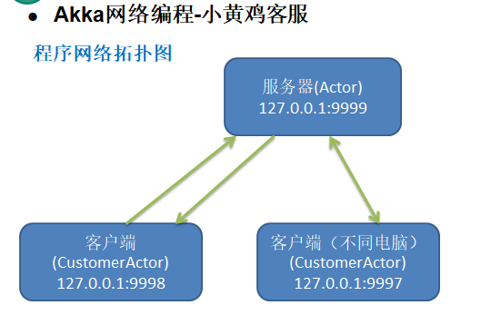
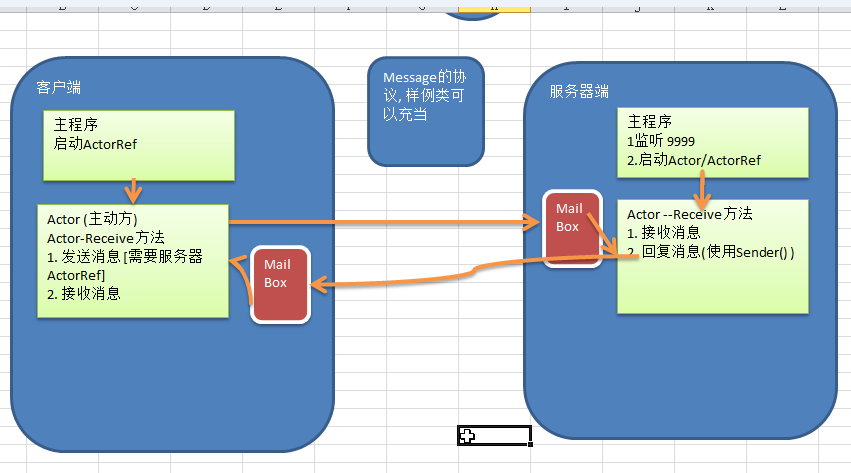
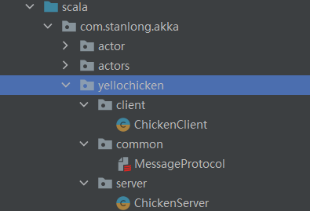

# 小黄鸡通信

## 需求分析

1. 服务端进行监听(9999)
2. 客户端可以通过键盘输入，发送咨询问题给小黄鸡客服(服务端)
3. 小黄鸡(服务端) 回答客户的问题

## 程序网络拓扑图



## 程序框架图



## 目录结构



**ChickenServer**

```scala
package com.stanlong.akka.yellochicken.server

import akka.actor.{Actor, ActorRef, ActorSystem, Props}
import com.stanlong.akka.yellochicken.common.{ClientMessage, ServerMessage}
import com.typesafe.config.ConfigFactory

class ChickenServer extends Actor{
    override def receive: Receive = {
        case "start" =>{
            println("小黄鸡客服开始工作")
        }
        case ClientMessage(msg) =>{
            // 使用match case 匹配(模糊)
            msg match {
                case "姓名" => sender() ! ServerMessage("沈万三")
                case "性别" => sender() ! ServerMessage("男")
                case "年龄" => sender() ! ServerMessage("25")
                case _ => sender() ! ServerMessage("您问的什么?")
            }
        }
    }
}

// 主程序-入口
object ChickenServer extends App{

    val host = "127.0.0.1" //服务端ip地址
    val port = 9999
    //创建config对象,指定协议类型，监听的ip和端口
    val config = ConfigFactory.parseString(
        s"""
           |akka.actor.provider="akka.remote.RemoteActorRefProvider"
           |akka.remote.netty.tcp.hostname=$host
           |akka.remote.netty.tcp.port=$port
        """.stripMargin)

    // 创建ActorSystem
    val serverActorSystem =  ActorSystem("Server", config)

    // 创建ChickenServer的actor和返回的actorRef
    val chickenServerRef : ActorRef = serverActorSystem.actorOf(Props[ChickenServer], "ChickenServer")

    // 启动
    chickenServerRef ! "start"
}
```

**ChickenClient**

```scala
package com.stanlong.akka.yellochicken.client

import akka.actor.{Actor, ActorRef, ActorSelection, ActorSystem, Props}
import com.stanlong.akka.yellochicken.common.{ClientMessage, ServerMessage}
import com.typesafe.config.ConfigFactory

import scala.io.StdIn

class ChickenClient(serverHost:String, serverPort:Int) extends Actor{
    // 定义一个ChickServerRef
    var serverActorRef : ActorSelection = _

    // preStart() 将初始化的代码放在这个方法里
    override def preStart(): Unit = {
        // println("preStart 已被调用")
        serverActorRef = context.actorSelection(s"akka.tcp://Server@${serverHost}:${serverPort}/user/ChickenServer")

    }
    override def receive: Receive = {
        case "start" =>{
            println("客户端运行，可以咨询问题")
        }
        case msg:String=>{
            // 发送消息给服务端
            serverActorRef ! ClientMessage(msg) // 这里是使用了样例类的 apply 方法
        }
        case ServerMessage(msg)=>{
            println(s"接收到服务端的回复：$msg")
        }

    }
}


//  主程序入口
object ChickenClient extends App{
    val (clientHost,clientPort,serverHost,serverPort) = ("127.0.0.1",9990,"127.0.0.1",9999)
    val config = ConfigFactory.parseString(
        s"""
           |akka.actor.provider="akka.remote.RemoteActorRefProvider"
           |akka.remote.netty.tcp.hostname=$clientHost
           |akka.remote.netty.tcp.port=$clientPort
        """.stripMargin)

    // 创建ActorSystem
    val clientActorSystem =  ActorSystem("client", config)

    // 创建chickenClient的actor和返回的actorRef
    val chickenClientRef: ActorRef = clientActorSystem.actorOf(Props(new ChickenClient(serverHost, serverPort)), "ClientActor")

    // 启动， 发送start
    chickenClientRef ! "start"

    // 客户端发送消息给服务器
    while (true){
        println("请输入要咨询的问题：")
        val msg = StdIn.readLine()
        chickenClientRef ! msg
    }
}
```

MessageProtocol

```scala
package com.stanlong.akka.yellochicken.common

// 使用样例类来构建客户端发给服务端的协议，样例类默认实现序列化
case class ClientMessage(msg:String)


// 使用样例类来构建服务端发给客户端的协议，样例类默认实现序列化
case class ServerMessage(msg:String)
```


